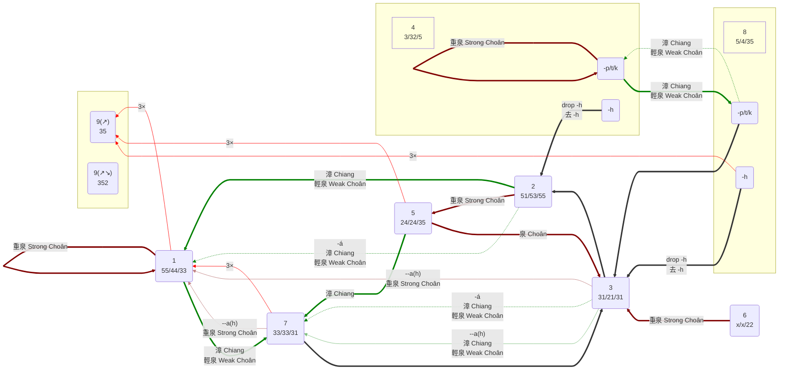
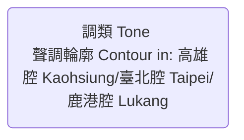

# Common TL Phonetic notation system — Taiwanese Hokkien

← <https://hackmd.io/@IID/Common-TL-Phonetic>

Taiwanese Hokkien Transcription Specification, Using CTL\
臺灣閩南語的標音方式，使用 CTL

Compared with `TL,POJ`. The `,POJ` part is omitted when the `POJ` part the same as the `TL` part.\
與 `臺羅,白話字` 比較。`,白話字` 部份在當 `白話字` 部份與 `臺羅` 相同時省略。

TL morphemes which represent non&ndash;frequently-used or dialectal phone segments are represented in **bold** in the tables.\
表示非常用或方言語音音段的臺羅字素在表格中以**粗體**表示。

The phonetic notation of the following examples are based on Kaohsiung accent.\
以下範例以高雄腔為標音參考。

## Syllable Initial 聲母

| Bilabial   雙唇音 | Alveolar   齦音 | Alveolo&ndash;palatal   齦&ndash;硬齶音 | Velar & Gutturals   軟齶音 & 喉音類 |
| --- | --- | --- | ---
| p ⟨p⟩ /p/ | t ⟨t⟩ /t/ | | k ⟨k⟩ /k/
| ph ⟨ph⟩ /pʰ/ | th ⟨th⟩ /tʰ/ | | kh ⟨kh⟩ /kʰ/
| b ⟨b⟩ /b/ | l ⟨dl⟩ /d/=/l/   (l,(j)&nbsp;⟨dl⟩&nbsp;/dz/) | | g ⟨g⟩ /ɡ/   (g(i),&#8288;(j(i))&nbsp;⟨g(i)⟩&nbsp;dz/\_\_j&nbsp;/&#8288;ɡ/)
| m ⟨m⟩ b/\_\_◌̃ [m] | n ⟨n⟩ l/\_\_◌̃ [n] | **gn/j(inn)**,(n) ⟨gn⟩ dz/\_\_j̃ [ȵ] | ng ⟨ng⟩ g/\_\_◌̃ [ŋ]
| | ts,ch ⟨ts⟩ /ts/ | (ts(i),ch(i) ⟨tsc⟩ ts/\_\_j [tɕ])
| | tsh,chh ⟨tsh⟩ /tsʰ/ | (tsh(i),chh(i) ⟨tsch⟩ tsʰ/\_\_j [tɕʰ])
| | (j ⟨j⟩ /dz/ [z]) | (j(i) ⟨jz⟩ dz/\_\_j [ʑ])
| | j ⟨dj⟩ [dz]~/d/ | (j(i) ⟨djz⟩ dz/\_\_j [dʑ])
| | s ⟨s⟩ /s/ | (s(i) ⟨sc⟩ s/\_\_j [ɕ]) | h ⟨h⟩ /h/

- In TL, "gn" is transcribed as "j(inn)" by the Ministry Of Education of Taiwan.\
  臺羅 的「gn」被臺灣教育部標為 "j(inn)"。
- "ts" & "tsh" are used in some POJ varieties. In such varieties, when their are used together with "ch" & "chh", the "ch" series is used before "i" and the "ts" series is used otherwise.\
  「ts」與「tsh」用於某些 白話字 拼法版本。在這些拼法版本中，當「ch」與「chh」也用於標音時，「ch」系列用於「i」前，而「ts」系列用於其它狀況。

Phonological remarks 有關音韻方面:

- l ⟨dl⟩ /d/=/l/ is often pronounced as a (possibly lateral) flap or a tap 常發為（可能為邊音的）彈音或閃音:
  - Transcribed below as an alveolar lateral flap/tap [ɺ] for simplicity.\
    以下標音為齒齦邊彈/閃音 [ɺ] 以示簡潔。
- The following voiced initials are often (voicelessly by default) prenasalized when not followed by nasalized final. The prenasalization is omitted below for simplicity:\
  下列濁音聲母不接鼻化韻母時，常以（預設為清音化的）鼻音起音，以下標音省略以示簡潔：
  - b ⟨b⟩ /b/ [ᵐ̥b] → as [b] below 以下標音為 [b]
  - l ⟨dl⟩ /d/=/l/ [ⁿ̥ɺ] → as [ɺ] below 以下標音為 [ɺ]
  - g ⟨g⟩ /ɡ/ [ᵑ̊ɡ] → as [ɡ] below 以下標音為 [ɡ]
- j [dz]\~/d/ ⟨dj⟩\~⟨dl⟩ & j(i) [dʑ]\~/d/ ⟨djz⟩\~⟨dl(i)⟩ occur in Choân-chiu accents 見於偏泉腔
- j [z] ⟨j⟩ & j(i) [ʑ]~/ɡ/ ⟨jz⟩\~⟨g⟩ occur in Chiang-chiu accents 見於偏漳腔
- The following alveolo&ndash;palatals are conditional allophones and do not occur in some accents:\
  下列齦&ndash;硬齶音為條件音位變體，未見於某些口音：
  - Conditional allophone 條件音位變體 → Pronunciation when not occur 未出現時的發音
  - ts(i) ts/\_\_j [tɕ] ⟨tsc⟩ → [ts] ⟨ts(i)⟩
  - tsh(i) tsʰ/\_\_j [tɕʰ] ⟨tsch⟩ → [tsʰ] ⟨tsh(i)⟩
  - j(i) dz/\_\_j [ʑ]~/ɡ/ ⟨jz⟩ → [z] ⟨j(i)⟩
  - j(i) dz/\_\_j [dʑ]~/l/ ⟨djz⟩ → [dz] ⟨dj(i)⟩
  - s(i) s/\_\_j [ɕ] ⟨sc⟩ → [s] ⟨s(i)⟩

### Transcription differences between TL and CTL on initials 臺羅拼音與 CTL 音標在聲母上的標音差異

| TL | IPA | CTL | Notes 備註
|:---:|:---:|:---:| ---
**l** | /d/ = /l/   [d]\~&#8288;[ɾ]\~&#8288;[ɺ]\~&#8288;[l]   *ad hoc* "**[ᵈl]**" | **⟨dl⟩** | Pronounced as a flap or a tap   發為彈音或閃音
m**◌**   n**◌**   ng**◌** | /m**◌&#8288;̃**/   /n**◌&#8288;̃**/   /ŋ**◌&#8288;̃**/ | ⟨m**◌nn**⟩   ⟨n**◌nn**⟩   ⟨ng**◌nn**⟩ | Irregular spelling of TL 臺羅的不規則拼音
**ji**◌**nn**   **gn**◌ | (dz/\_\_j̃◌̃)   [ɲ**◌&#8288;̃** ]\~[ȵ**◌&#8288;̃** ] | ⟨**gn**◌**nn**⟩ | Used in Éng-tsēng old Chiang-chiu dialect   用於永靖老漳州腔   *The transcription will be changed to 標音將改成:   ⟨**gni**◌**nn**⟩*
t**si**◌   t**shi**◌   **si**◌ | /tsj◌/ [t**ɕ**◌]   /tsʰj◌/ [t**ɕʰ**◌]   /sj◌/ [**ɕ**◌] | ⟨t**sci**◌⟩   ⟨t**schi**◌⟩   ⟨**sci**◌⟩ | Differentiated from the following THRS used for transcribing Taiwanese Hakka dialects other than the Sixian dialects:   區分於下列客家語拼音方案用於拼寫四縣諸腔以外腔調的：   "zi◌" ⟨**tsi**◌⟩  [t**sj**◌]、"ci◌" ⟨**tshi**◌⟩ [t**shj**◌]、與 "si◌" ⟨**si**◌⟩ [**sj**◌]
j   **ji**◌ | /dz/ [z]   /dzj◌/ [**ʑ**◌] | ⟨j⟩   ⟨**jzi**◌⟩ | Pronounced as a fricative; Chiang-chiu accents   發為擦音；偏漳腔口音   Used when the affricate and fricative pronunciations are mixed in the utterance and no strict distinction is made to them.   當語中混用塞擦音與擦音的發音，且不對其做嚴格區分時，使用此標音。
j   **ji**◌ | /dz/ [**d**z]   /dzj◌/ [**dʑ**◌] | ⟨**d**j⟩   ⟨**djzi**◌⟩ | Pronounced as an affricate; Choân-chiu accents   發為塞擦音；偏泉腔口音

## Syllable Final 韻母

The tone is artificially set to either light level tone ⟨5⟩ or light entering tone ⟨8⟩ for demonstration.\
聲調皆強制設為陽平聲 ⟨5⟩ 或陽入聲 ⟨8⟩ 以作示範。

| ↓Medial +&nbsp;Nucleus   ↓介音 +&nbsp;主要韻母 | Coda→   韻尾→ | /ʔ/   ⟨-h⟩ | /◌̃/   ⟨-&#8288;nn⟩ | /◌̃ʔ/   ⟨-&#8288;nnh⟩ | /m/   ⟨-&#8288;m⟩ | /p̚/   ⟨-&#8288;p⟩ | /n/   ⟨-n⟩ | /t̚/   ⟨-&#8288;t⟩ | /ŋ/   ⟨-&#8288;ng⟩ | /k̚/   ⟨-&#8288;k⟩ | /j/   ⟨-i⟩ | /jʔ/ ⟨-&#8288;ih⟩ | /◌̃j̃/   ⟨-&#8288;inn⟩ | /◌̃j̃ʔ/   ⟨-&#8288;innh⟩ | /w/   ⟨-u⟩ | /wʔ/   ⟨-&#8288;uh⟩ | /◌̃w̃/   ⟨-&#8288;unn⟩ | /◌̃w̃ʔ/ ⟨-&#8288;unnh⟩ |
| --- | --- | --- | --- | --- | --- | --- | --- | --- | --- | --- | --- | --- | --- | --- | --- | --- | --- | --- |
| /a/ ⟨a⟩ | á | a̍h | ânn,âⁿ | a̍nnh,a̍ⁿh | âm | a̍p | ân | a̍t | âng | a̍k | âi | **a̍ih** | âinn,âiⁿ | **a̍innh,(?)** | âu | a̍uh | | **a̍unnh,(?)** |
| /e/ ⟨e⟩ | ê | e̍h | ênn,êⁿ | e̍nnh,e̍ⁿh | | | (iân) | (ia̍t) | (îng,êng) | (i̍k,e̍k) | | | | | | | | |
| /ɛ/ ⟨ee⟩ | **êe,ê͘** | **e̍eh,e̍͘&nbsp;h** | **êenn,ê͘&nbsp;ⁿ** | | | | (iân) | (ia̍t) | **êng,ê͘&nbsp;ng** | **e̍k,e̍͘&nbsp;k** | | | | | | | | |
| /ɨ/ ⟨ir⟩ | **îr,(î/û)** [ɹ̩]\~[ɨ] | | | | **îrm,(îm/ûm)** | **i̍rp,(i̍p/u̍p)** | **îrn,(în/ûn)** | **i̍rt,(i̍t/u̍t)** | **îrng,(êng/ûng)** | **i̍rk,(e̍k/u̍k)** | | | **irînn,(êng/oâiⁿ)** | | | | | |
| /ɘ/ ⟨er⟩ | **êr,(ê)** | **e̍rh,(e̍h)** | | | (m̂ [ə̯m̩]) | | | | (n̂g [ə̯ŋ̍]) | | | | | | **erû,(iô)** /&#8288;ɘ̯u/ | | | |
| /ɘ̯e/ ⟨ere⟩ | **erê,(ôe)** | **ere̍h,(oe̍h)** | | | | | | | | | | | | | | | | |
| /i/ ⟨i⟩ | î | i̍h | înn,îⁿ | i̍nnh,i̍ⁿh | îm | i̍p | în | i̍t | (îng,êng) | (i̍k,e̍k) | | | | | | | | |
| /iə̯/ ⟨ier⟩ | | | | | | | | | îng,êng | i̍k,e̍k | | | | | | | | |
| (/jo/ [jə]\~[jɤ] ⟨io/ior⟩) | (iô\(r\),(iô)) | (io̍\(r\)h,(io̍h)) | | | | | | | (îng,êng) | (i̍k,e̍k) | | | | | | | | |
| /jo/ [jo] ⟨io⟩ | iô | io̍h | | | | | | | | | | | | | | | | |
| /jɔ/ ⟨ioo⟩ | **iôo,(?)** | | **iônn,(iûⁿ)** | **io̍nnh,(iu̍ⁿh)** | | | | | iông | io̍k | | | | | | | | |
| /ju/ ⟨iu⟩ | iû | iu̍h | iûnn,iûⁿ | iu̍nnh,iu̍ⁿh | | | | | | | | | | | | | | |
| /jɛ/ ⟨iee⟩ | | | | | | | iân | ia̍t | **iêng,(êng)** | | | | | | | | | |
| /ja/ ⟨ia⟩ | iâ | ia̍h | iânn,iâⁿ | ia̍nnh,ia̍ⁿh | iâm | ia̍p | (iân) | (ia̍t) | iâng | ia̍k | | | | | iâu | ia̍uh | iâunn,iâuⁿ | |
| (/o/ [ə]\~[ɤ] ⟨o/or⟩) | (ô\(r\),(ô)) | (o̍\(r\)h,(o̍h)) | | | | | | | | | | | | | | | | |
| /o/ [o] ⟨o⟩ | ô | o̍h | | | | | | | | | | | | | | | | |
| /ɔ/ ⟨oo⟩ | ôo,ô͘ | o̍oh,o̍͘h | ônn,ôⁿ | o̍nnh,o̍ⁿh | ôm | o̍p | | | ông | o̍k | | | | | | | | |
| /u/ ⟨u⟩ | û | u̍h | | | | | ûn | u̍t | | | uî,ûi /wi/ | **ui̍h,(?)** /wiʔ/ | **uînn,ûiⁿ** /w̃ĩ/ | | | | | |
| /wa/ ⟨ua⟩ | uâ,ôa | ua̍h,oa̍h | uânn,ôaⁿ | | | | uân,oân | ua̍t,oa̍t | **uâng,(?)** | | uâi,oâi | | uâinn,oâiⁿ | | | | | |
| /wɛ/ ⟨uee⟩ | **uêe,(ôe)** | | | | | | | | | | | | | | | | | |
| /we/ ⟨ue⟩ | uê,ôe | ue̍h,oe̍h | | | | | | | | | | | | | | | | |
| /m̩/ ⟨m⟩ | m̂ | m̍h | | | | | | | | | | | | | | | | |
| /ŋ̍/ ⟨ng⟩ | n̂g | n̍gh | | | | | | | | | | | | | | | | |

- In some POJ varieties, "e͘ " or  "ɛ" are used for transcribing the "ee" phoneme in TL. The above table only lists "e͘ " for simplicity.\
  在一些 白話字 拼法版本中，會使用「e͘ 」或「ɛ」來標注臺羅的「ee」音位。以上的表格僅列出「e͘ 」以示簡潔。
- In some POJ varieties, "o͘" is written as "ou" and "ⁿ" is written as "N".\
  在一些 白話字 拼法版本中，「o͘」寫為「ou」且「ⁿ」寫為「N」。

Phonological remarks 有關音韻方面:

- /ʔ/ ⟨-h⟩ is not pronounced when the syllable has its tone pronounced neither as tone 4 nor as tone 8 and is not followed by a stressed syllable with null initial. Examples:\
  /ʔ/ ⟨-&#8288;h⟩ 當其所在音節的聲調發為非第 4 調且非第 8 調，且後不接重讀的零聲母音節時，將不發音。例如：
  - 拍肉 phah-bah ⟨phah14→12-bah→14⟩ /pʰaʔ˧.baʔ˧/: [pʰaː꜒꜖.&zwnj;baʔ꜔]
  - 大伯仔 tuā-peh-á,tōa-peh-á ⟨tua17→13-peh14→11-a→12⟩ /ˈtwa˧˧.ˈpeʔ˧.a˥˩/: [ˈtʷaː꜔꜖.ˈpeː꜒꜒.a꜒꜖]
- /ʔ/ ⟨-h⟩ is sometimes not pronounced when it occur at the end of a prosodic unit. Examples:\
  /ʔ/ ⟨-h⟩ 在韻律單位結尾處輕讀時，有時不發音。例如：
  - 你咧創**啥物**？ lí ⟨dli12→11⟩ teh ⟨teh14⟩ → ⟨te→11⟩ tshòng,chhòng ⟨tshoong→13⟩ **-&zwnj;-siánn-mi̍h,-&zwnj;-siáⁿ-mi̍h ⟨sciann11→111-mih18→111⟩** /ɕjã˥˥.mĩʔ˥/: [ɕã(ː)꜔꜖.mĩʔ꜔]\~[ɕã(ː)꜔꜖.mĩ(ː)꜔(꜖)]
- In stressed syllables, finals without coda (after considering tone modifications and ignoring nasalization) are pronounced with lengthened nucleus. Examples:\
  在重讀音節中，無韻尾（考慮泛變調並忽略鼻化後）的韻母發音時，其主要韻母會延長。例如：
  - 逐家 ta̍k-ke ⟨tak18→14-ke→11⟩ /tak̚˥.ke˥˥/: [tak̚꜔.keː꜒꜒] ≡ [ta꜔.kːeː꜒꜒]
    - vs. 大家 ta-ke ⟨ta11-ke11⟩ /ta˥˥.ke˥˥/: /taː꜔꜔.keː꜒꜒/
  - 大儂/大人 tuā-lâng,tōa-lâng ⟨tua17→13-lang→15⟩ /twa˧˧.laŋ˨˦/: [tʷaː꜔꜖.ɺaŋ꜕꜓]
- Finals with a nasal coda (/m/, /n/, or /ŋ/) may become nasalized (along with the non-null initial) when the initial is a null phoneme or a voiced obstruent and is immediately preceded by a syllable ending in a nasal(ized) phone:\
  有鼻音韻尾（/m/, /n/, 或 /ŋ/）的韻母在當聲母為零音位或濁阻礙音，且前緊接以鼻（化）音結尾的音節時，可能（與非零音位聲母一起）變得鼻化：
  - 毋免 m̄-bián ⟨m17→13-bieen→12⟩ /m̩˧˧.biɛn˥˩/: [(ʔ)m̩ː꜔꜖.biɛn꜒꜖] → [(ʔ)m̩ː꜔꜖.b̃ĩɛ̃n꜒꜖] \~ [(ʔ)m̩ː꜔꜖.mĩɛ̃n꜒꜖] ≡ [(ʔ)mːˑĩɛ̃n꜔꜖꜒꜖]

### Transcription differences between TL and CTL on finals 臺羅拼音與 CTL 音標在韻母上的標音差異

| TL | IPA | CTL | Notes 備註
| :---: | :---: | :---: | ---
**i**ng   **i**k | /**iə̯**ŋ/&nbsp;[**i(ə̯**)ŋ]\~&#8288;[**jə**ŋ]   /**iə̯**k̚/&nbsp;[**i(ə̯**)k̚]\~&#8288;[**jə**k̚] | ⟨**ie**ng⟩   ⟨**ie**k⟩ | *The transcription will be changed to 標音將改成:   ⟨**ier**ng⟩   ⟨**ier**k⟩   &nbsp;*
i**e**ng   i**e**k | /j**ɛ**ŋ/   /j**ɛ**k̚/ | ⟨i**ee**ng⟩   ⟨i**ee**k⟩ | Irregular spelling of TL 臺羅的不規則拼音
**e**ng   **e**k | /**ɛ**ŋ/   /**ɛ**k̚/ | ⟨**ee**ng⟩   ⟨**ee**k⟩ | Irregular spelling of TL 臺羅的不規則拼音   **e** ⟨**e**⟩ /**e**/ ≠ **ee** ⟨**ee**⟩ /**ɛ**/   **e**h ⟨**e**h⟩ /**e**ʔ/ ≠ **ee**h ⟨**ee**h⟩ /**ɛ**ʔ/   u**e** ⟨u**e**⟩ /w**e**/ ≠ u**ee** ⟨u**ee**⟩ /w**ɛ**/
i**o**nn   i**o**nnh   i**o**ng   i**o**k | /j**ɔ̃**/   /j**ɔ̃**ʔ/   /j**ɔ**ŋ/   /j**ɔ**k̚/ | ⟨i**oo**nn⟩   ⟨i**oo**nnh⟩   ⟨i**oo**ng⟩   ⟨i**oo**k⟩ | Irregular spelling of TL 臺羅的不規則拼音   i**o** ⟨i**o**⟩ /j**o**/ ≠ i**oo** ⟨i**oo**⟩ /j**ɔ**/
**o**nn   **o**nnh   **o**m   **o**p   **o**ng   **o**k | /**ɔ̃**/   /**ɔ̃**ʔ/   /**ɔ**m/   /**ɔ**p̚/   /**ɔ**ŋ/   /**ɔ**k̚/ | ⟨**oo**nn⟩   ⟨**oo**nnh⟩   ⟨**oo**m⟩   ⟨**oo**p⟩   ⟨**oo**ng⟩   ⟨**oo**k⟩ | Irregular spelling of TL 臺羅的不規則拼音   **o** ⟨**o**⟩ /**o**/ ≠ **oo** ⟨**oo**⟩ /**ɔ**/   **o**h ⟨**o**h⟩ /**o**ʔ/ ≠ **oo**h ⟨**oo**h⟩ /**ɔ**ʔ/
**ia**n   **ia**t | /**jɛ**n/&nbsp;[**ja**n]\~&#8288;[**(j)e**n]   /**jɛ**t̚/&nbsp;[**ja**t̚]\~&#8288;[**(j)e**t̚] | ⟨**iee**n⟩   ⟨**iee**t⟩ | Differenciated from the following THRS used in Taiwanese Hakka Hailu and Southern Sixian dialects:   區分於下列客家語拼音方案用於拼寫海陸腔與南四縣腔的：   "**ia**n" ⟨**ia**n⟩ [**ja**n] & "**ia**d" ⟨**ia**t⟩ [**ja**t̚]

## Syllable Tone 聲調

The 1-digit tones are not prefixed.\
單一位數字聲調無前綴。

Will be changed to be prefixed with `1`.\
將改成加上 `1` 前綴。

`ah` represents a syllable which ends in one of -p /p̚/ ⟨-p⟩, -t /t̚/ ⟨-t⟩, -k /k̚/ ⟨-k⟩, & -h /ʔ/ ⟨-h⟩. `a` represents a syllable which does not.\
`ah` 表示以 -p /p̚/ ⟨-p⟩, -t /t̚/ ⟨-t⟩, -k /k̚/ ⟨-k⟩, & -h /ʔ/ ⟨-h⟩ 之一結尾的音節；`a` 表示不是此類的音節。

TL/POJ tones are listed as `TL,TL (number),POJ` with the `,POJ` part optional.\
臺羅/白話字聲調以 `臺羅,臺羅（數字版）,白話字` 列出，其中 `,白話字` 部份可省略。

| | Name   調名 | TL/POJ   臺羅/白話字 | Contour   (Kaohsiung)   聲調輪廓   （高雄腔） | Contour   (Taipei)   聲調輪廓   （臺北腔） | Contour   (Tainan)   聲調輪廓   （臺南腔） | Contour   (Lukang)   聲調輪廓   （鹿港腔）
|:--- | ---:|:---:|:---:|:---:|:---:|:---:
0   **10** | neutral 輕聲   (dependent contour 隨前調) | -&#8288;\-&#8288;...,a(h)0 | ⟨1/8⟩/⟨7/4⟩/⟨→3⟩ Note:MNV | ⟨→1/8⟩/⟨7/4⟩/⟨→3⟩ | ⟨1/8⟩/⟨7/4⟩/⟨→3⟩ | ⟨2/4⟩/⟨1/8⟩/⟨→3⟩
1   **11** | dark level 陰平 | a,a1 | 55 /˥˥/ | 44 /˦˦/   →55 [꜒꜒] | 44 /˦˦/ | 33 /˧˧/
2   **12** | dark rising 陰上 | á,a2 | 51 /˥˩/ | 53 /˥˧/ | 41 /˦˩/ | 55 /˥˥/   →53 [꜒꜔]
3   **13** | dark departing 陰去 | à,a3 | 31 /˧˩/   →1(1) [꜖(꜖)] | 21 /˨˩/   →1(1) [꜖(꜖)] | 21 /˨˩/   →1(1) [꜖(꜖)] | 31 /˧˩₃/   →2(2) [꜕(꜕)]
4   **14** | dark entering 陰入 | ah,ah4 | 3 /˧/   →1 [꜖] | 32 /˧˨/   →1 [꜖] | 32 /˧˨/   →1 [꜖] | 5 /˥/
5   **15** | light level 陽平 | â,a5 | 24 /˨˦/ | 24 /˨˦/ | 23 /˨˧/ | 24 /˨˦/   →35 [꜔꜒]
6   **16** | light rising 陽上 | **ǎ,a6,(?)** | :x: | :x: | :x: | 22 /˨˨/
7   **17** | light departing 陽去 | ā,a7 | 33 /˧˧/ | 33 /˧˧/ | 33 /˧˧/ | 31 /˧˩₇/ (⟨3⟩)
8   **18** | light entering 陽入 | a̍h,ah8 | 5 /˥/ | 4 /˦/ | 4 /˦/ | 35 /˧˥/
9   **19** | "tone 9" 「第九調」   (rising&nbsp;contour 昇調) | a̋(h),a(h)9,(?) | 35 /˧˥/ (∈⟨5⟩) | | | ⟨→5⟩
**110** | "tone 9" 「第九調」   (rising-&#8288;falling contour 昇降調) | a̋(h),a(h)9,(?) | 352 /˧˥˨/ | | |
**111** | neutral 輕聲   (fixed low contour 固定低調) | -&#8288;\-&#8288;...,a(h)0 | ⟨→3⟩ | ⟨→3⟩ | ⟨→3⟩ | ⟨→3⟩

- The tone contour for "tone 9" is tentatively set to the same for all dialects and the fields are only filled for Kaoksiung accent in this table.\
  各腔的「第九調」暫設成同一聲調輪廓，此表中僅填於高雄腔的欄位。

※ There exist a different opinion for the actual tone contour 具體的聲調輪廓另有不同說法: <https://en.wikipedia.org/wiki/Taiwanese_Hokkien#Tones>

Inline notes

*[Note:MN0]: If a distinction is made between neutral tones with dependent contour and fixed low contour, then the dependent one is transcribed with ⟨10⟩ and the fixed one transcribed with ⟨111⟩; otherwise both are transcribed with ⟨0⟩ or ⟨10⟩.　若區分 **隨前調輕聲** 與 **固定低調輕聲**，則以 ⟨10⟩ 標出隨前調輕聲，並以 ⟨111⟩ 標出固定低調輕聲；否則皆以 ⟨0⟩ 或 ⟨10⟩ 標調。
*[Note:MNV]: `high/mid/low` levels　分別是 `高/中/低` 等級

**Note MN0**: If a distinction is made between neutral tones with dependent contour and fixed low contour, then the dependent one is transcribed with ⟨10⟩ and the fixed one transcribed with ⟨111⟩; otherwise both are transcribed with ⟨0⟩ or ⟨10⟩.　若區分 **隨前調輕聲** 與 **固定低調輕聲**，則以 ⟨10⟩ 標出隨前調輕聲，並以 ⟨111⟩ 標出固定低調輕聲；否則皆以 ⟨0⟩ 或 ⟨10⟩ 標調。\
**Note MNV**: `high/mid/low` levels　分別是 `高/中/低` 等級

- In TL, All syllables after `--` are pronounced with neutral tone within a hyphenated (`-`) phrase; `--` is sometimes omitted when the use of neutral tone does not cause semantic differences of the word.　臺羅中，以連字號 (`-`) 連接的短語中，`--` 後的所有音節皆讀為輕聲；當輕聲與否不造成詞義差異時，有時會省略不標出 `--`。
- The neutral tone with dependent contour has high/mid/low flat contours, which are used when the ending of the pronounced tone contour of the preceding syllable is `high/mid/low`.\
  隨前調輕聲有 高/中/低 平輪廓，分別用在前一音節的實際發音的聲調輪廓的結尾為 `高/中/低` 時。
  - Tones with `high/mid/low`-ending tone contour in their citation form:\
    本調的聲調輪廓以 `高/中/低` 等級結尾的聲調：
    - `1/5,7/8,2,3,4` (Choân-chiu accents 偏泉腔)
    - `1/5,7,8/2,3,4` (Chiang-chiu accents 偏漳腔)
- Syllables originally in the light rising tone ⟨6⟩ are now often distributed to other tones:\
  原陽上聲 ⟨6⟩ 多已派入其它調：
  - Chiang-chiu accents, vernacular reading: Light departing tone ⟨7⟩\
    偏漳腔，白讀：陽去聲 ⟨7⟩
  - Chiang-chiu accents, literary reading: Dark rising tone ⟨2⟩.\
    偏漳腔，文讀：陰上聲 ⟨2⟩
  - Choân-chiu dialect, vernacular reading: Light rising tone ⟨6⟩\
    泉洲腔，白讀：陽上聲 ⟨6⟩
  - Choân-chiu dialect, with voiced obstruent initial in middle Chinese: Mainly light rising tone ⟨6⟩\
    泉洲腔，在中古漢語中有濁阻塞音聲母：多為陽上聲 ⟨6⟩
  - Choân-chiu dialect, otherwise: Dark rising tone ⟨2⟩.\
    泉洲腔，其它狀況：陰上聲 ⟨2⟩
- In Choân-chiu dialect, the citation form of the dark ⟨3⟩ and light ⟨7⟩ departing tones are merged.\
  泉洲腔中，陰 ⟨3⟩、陽 ⟨7⟩ 去聲的本調已合流。

### Tone Modifications 泛變調

Note: These rules only deal with usual cases and are not necessary comprehensive.\
注意：這些規則僅處理一般常見情況，並不必然完整。

Prosodic unit rules 韻律單位規則:
- In a prosodic unit, all syllables beginning at the first neutral-tone syllable undergo neutral tone change; then all syllables before the last non&ndash;neutral-tone syllable undergo normal tone sandhi.\
  在韻律單位內，所有從第一個輕聲音節開始的音節都經過輕聲語素變調，然後所有在最後一個非輕聲音節前的音節都經過通常連續變調。
- A prosodic unit in Taiwanese Hokkien usually includes:\
  臺灣閩南語中的韻律單位通常包含：
  - A stressed noun-like element (possibly omitted but implied from context) and its optional preceding verb-like phrases and modifiers;\
    一個重讀類名詞元素（可能被省略但被上下文暗示）與其前可出現的類動詞短語與修飾詞；
  - Or a stressed verb-like phrase element and its modifiers.\
    或一個重讀類動詞短語元素與修飾詞。
- Some aspect markers are often the end of a prosodic unit. Examples:\
  一些體貌標記常為韻律單位的結尾。例如：
  - 了 liáu ⟨dliau12⟩, 好 hó ⟨ho12/hor12⟩, 完 uân,oân ⟨uan15⟩, 煞 suah,soah ⟨suah14⟩
- In triplicated one-syllable noun or verb, each syllable is an end of a prosodic unit.\
  在三疊單音節名詞或動詞中，各個音節都是一韻律單位的結尾。
- The affirmative part of a sentence-final bipolar question (A-not-A construction) is the end of a prosodic unit.\
  句尾的正反問句 (A-not-A 結構) 的肯定部份為一韻律單位的結尾。
- 的 ê ⟨e15⟩ ends the preceding prosodic unit (if the unit already contains stressed element).\
  的 ê ⟨e15⟩ 結束其前的韻律單位（若該單位已含重讀元素）。
- An inserted pause in utterance after a noun-like or verb-like element also ends the preceding prosodic unit.\
  語中插入在類名詞或類動詞後的停頓也結束其前的韻律單位。

Tone Contour Change Relation Chart 聲調輪廓變化關係圖:

- Except for Choân-chiu dialect, the outcome of syllables with light entering tone ⟨8⟩ and non-"-h /ʔ/ ⟨-h⟩" coda undergoing the normal tone sandhi can be also transcribed as dark entering tone ⟨→4⟩.\
  除了泉州腔，韻尾不為「-h /ʔ/ ⟨-h⟩」的陽入聲 ⟨8⟩ 音節的通常連續變調結果也可標調為陰入聲 ⟨→4⟩。

Tone modification patterns (in application order) 泛變調模式（依套用先後順序）:

- Neutral tone change: For some words and phrases, if they are not the focus of the sentence and thus unstressed and no noun-like or verb-like elements occur later within the prosodic unit, simply change their tone to neutral tone, otherwise apply the other tone modification rules. Examples:\
  輕聲語素變調：某些詞與短語，當非句意重點而輕讀，且在所在的韻律單位中其後沒有重讀的類名詞或類動詞元素時，將其聲調直接改為輕聲，否則套用其它泛變調規則。例如：
  - Auxiliaries. (Dependent contour) Examples:\
    嘆詞。（隨前調）例如：
    - 啊 --ah ⟨ah10⟩
    - 哎 --aih ⟨aih10⟩
    - 欸 --eh ⟨eh10⟩
  - Personal pronouns. (Dependent contour) Examples:\
    人稱代名詞。（隨前調）例如：
    - 我 guá,góa ⟨gua12→10⟩ & 阮 guán,goán ⟨guan12→10⟩
    - 咱 lán2 ⟨dlan12→10⟩
    - 你 lí ⟨dli12→10⟩ & 恁 lín ⟨dlin12→10⟩
    - 伊 i ⟨i11→10⟩ & 𪜶 in ⟨in11→10⟩
    - 儂/人 lâng5 ⟨dlang15→10⟩
  - Interrogate pronouns. (Fixed low contour) Examples:\
    疑問代名詞。（固定低調）例如：
    - 啥 siánn ⟨sciann12→111⟩
    - 啥貨 siánn-huè ⟨sciann12→111-hue13→111⟩
    - 啥物 siánn-mi̍h ⟨sciann12→111-minnh18→111⟩
  - Verb complement suffix. (Fixed low contour) Examples:\
    動詞補語後綴。（固定低調）例如：
    - (Directional v. 趨向動詞 +) directional prep. 趨向介詞. Examples 例如:
      - 出來 tshut-lâi,chhut-lâi ⟨-tshut11→111-dlai15→111⟩
    - Prep. 介詞. Examples 例如:
      - 得 -tit ⟨-tit14→111⟩
      - 著 -tio̍h ⟨-tioh18→111⟩
    - Adv. 副詞. Examples 例如:
      - 未 -buē,-bōe ⟨-bue17→111⟩
      - 過 -kuè,-kòe ⟨-kue13→111⟩
      - 按呢 -án-ne ⟨-an12→111-nenn11→111⟩
    - ("佇 tī ⟨ti17⟩" +) Demonstrative pronouns 指示代名詞 ("遮 tsia,chia ⟨tscia11⟩"/"遐 hia ⟨hia11⟩"). Examples 例如:
      - 佇遮 -tī-tsia,-tī-chia ⟨-ti17→111-tscia11→111⟩
    - Adj. representing extent or consequence (varies from verb to verb) 表程度或後果的形容詞（因動詞而異）
    - Number 數詞 (+ classifier 量詞 (+ "仔 -á")). Examples 例如:
      - 三萬 -sann-bān,-saⁿ-bān ⟨-sann11→111-ban7→111⟩
      - 一下 -tsi̍t-ē,-chi̍t-ē ⟨-tscit18→111-e17→111⟩
      - 幾杯仔 -kuí-pue-á,-kúi-poe-á ⟨-kui12→111-pue11→111-a12→111⟩
  - Sentence-final verb extent particle. Examples:\
    句尾動詞程度助詞。例如：
    - Fixed low contour 固定低調. Examples 例如:
      - 未 --buē,-&zwnj;-bōe ⟨bue17→111⟩
      - 毋 --m̄7 ⟨m17→111⟩
      - 按怎 -án-tsuánn,-án-chóaⁿ ⟨-an12→111-tsuann12→111⟩
    - Dependent contour 隨前調: 矣 --ah ⟨ah10⟩
  - Suffix of conjunctive construction. (Fixed low contour) Examples:\
    連接結構後綴詞。（固定低調）例如：
    - (...) 無打緊 --bô-tánn-kín,-&zwnj;-bô-táⁿ-kín ⟨bo15→111-tann12→111-kin12→111⟩ (，閤 koh ⟨koh14→11⟩ ...)
    - ... 也 --iā ⟨ia17→111⟩ ...，... 也 --iā ⟨ia17→111⟩ ...
  - "的 --ê ⟨e15→10⟩" which makes a noun from non-nouns or in "是 sī ... 的 --ê" construction. (Dependent contour)\
    將非名詞名詞化或在「是 sī ... 的 --ê」結構中的「的 --ê ⟨e15→10⟩」。（隨前調）
  - "仔 --á" ⟨a12→10⟩ (affectionate diminutive suffix to person name or relative title 用於人名或親屬稱謂的親切小稱詞尾) (Dependent contour 隨前調)
  - Noun as a suffix modifying one-syllable noun.  (Fixed low contour) Examples:\
    作詞尾修飾單音節名詞的名詞詞尾。（固定低調）例如：
    - 家 --ka ⟨ka11→111⟩
    - 氏 --sī ⟨sci17→111⟩
    - 先生 --sian-senn,-&zwnj;-sian-seⁿ ⟨scieen11→111-senn11→111⟩
    - 月 --gue̍h,-&zwnj;-goe̍h ⟨gueh18→111⟩
  - "裏/裡 --lí ⟨dli12→10⟩\~⟨dli12→111⟩" (locative suffix to noun 用於名詞的位置詞尾) (Dependent contour or fix low contour 隨前調或固定低調)
- Double tone sandhi; fixed high contour: Simply change the tone to tone 1. Examples:\
  再連續變調；固定高調：將聲調直接改為第 1 調。例如：
  - 欲 beh ⟨beh14⟩ → ⟨be→11⟩
  - 佮 kah ⟨kah14⟩ → ⟨ka→11⟩
  - 甲 kah ⟨kah14⟩ → ⟨ka→11⟩
  - 閣 koh (adv. 副詞) ⟨koh14/korh14⟩ → ⟨ko→11/kor→11⟩
  - 毋**過** m̄-**koh** (conjunctive 連詞) ⟨m17-**koh14**/m17-**korh14**⟩ → ⟨m→13-**ko→11**/m→13-**kor→11**⟩
  - 才 tsiah,chiah (adv. 副詞) ⟨tsciah14⟩ → ⟨tscia→11⟩
  - 較 khah ⟨khah14⟩ → ⟨kha→11⟩
  - 咧 teh ⟨teh11⟩ → ⟨te→11⟩
  - 去 khì (v. 動詞) ⟨khi13→11⟩
  - 啥**物** siánn-**mi̍h** (demonstrative adj. 指示形容詞) ⟨sciann12-**minnh18**⟩ → ⟨sciann→11-**minn→11**⟩
- Tone sandhi right before neutral tone (fixed low contour): No changes.\
  固定低調輕聲前連續變調：不變。
- Tone sandhi right before neutral tone (dependent contour): Modify the tone along the solid arrow labeled `--a(h)` once if present, otherwise no changes.\
  隨前調輕聲前連續變調：沿著標有 `--a(h)` 的實心箭頭變調一次（若有），否則不變。
- Tone sandhi of the end of prosodic unit (if stressed): No changes.\
  韻律單位結尾連續變調（若重讀）：不變。
- Tone sandhi right before "-á (仔)" (normal diminutive suffix): Apply the rule of normal tone sandhi and then modify the tone along the dotted arrow labeled `-á` for multiple times until no further changes are possible.\
  「仔 (-á)」（普通小稱詞尾）前連續變調：套用通常連續變調規則，然後沿著標有 `-á` 的虛線箭頭變調多次，直到無法再變調。
- Tone sandhi of the first syllable of triplicated one-syllable adjective: Modify the tone along the solid arrow labeled `3×` once if present, otherwise apply the rule of normal tone sandhi.\
  三疊單音節形容詞首音節連續變調：沿著標有 `3×` 的實心箭頭變調（若存在），否則套用通常連續變調規則。
- Normal tone sandhi: Modify the tone along the thick arrow(s) once if present, otherwise no changes.\
  通常連續變調：沿著粗箭頭變調一次（若有），否則不變。

*[IPA]: International Phonetic Alphabet 國際音標

*[CTL]: Common TL 通用 TL

*[Common TL]: Common TL 通用 TL

*[TL]: Tâi-Lô; Taiwanese Romanization System 臺灣閩南語羅馬字拼音方案

*[臺羅]: Taiwanese Romanization System 臺灣閩南語羅馬字拼音方案

*[POJ]: Pe̍h-ōe-jī 白話字

*[白話字]: Pe̍h-ōe-jī 白話字

## References 參考資料

- Wikipedia contributors. (2021, August 19). Taiwanese Hokkien. In *Wikipedia, The Free Encyclopedia*. Retrieved 19:22, September 2, 2021, from https://en.wikipedia.org/w/index.php?title=Taiwanese_Hokkien&oldid=1039625767
- Wikipedia contributors. (2022, February 7). Help:IPA/Taiwanese Hokkien. In *Wikipedia, The Free Encyclopedia*. Retrieved 22:05, November 18, 2022, from https://en.wikipedia.org/w/index.php?title=Help:IPA/Taiwanese_Hokkien&oldid=1070451553
- 董忠司. (1991). 臺北市、臺南市、鹿港、宜蘭等四個方言音系的整理與比較. *新竹師範學報* 第五期. https://edujou.site.nthu.edu.tw/var/file/128/1128/img/1172/5-2.pdf
- 台灣閩南語變化調. (2009, Nov 15). Retrieved 15:17, November 16, 2022. http://kroneutforskern.blogspot.com/2009/11/neutralization-in-taiwanese-tone-sandhi.html
- 本調．變調．輕聲的分辨撇步. (2021, Jan 1). Retrieved 07:11, November 16, 2022. https://easytaiwanese.wordpress.com/2021/01/01/本調．變調．輕聲的分辨撇步